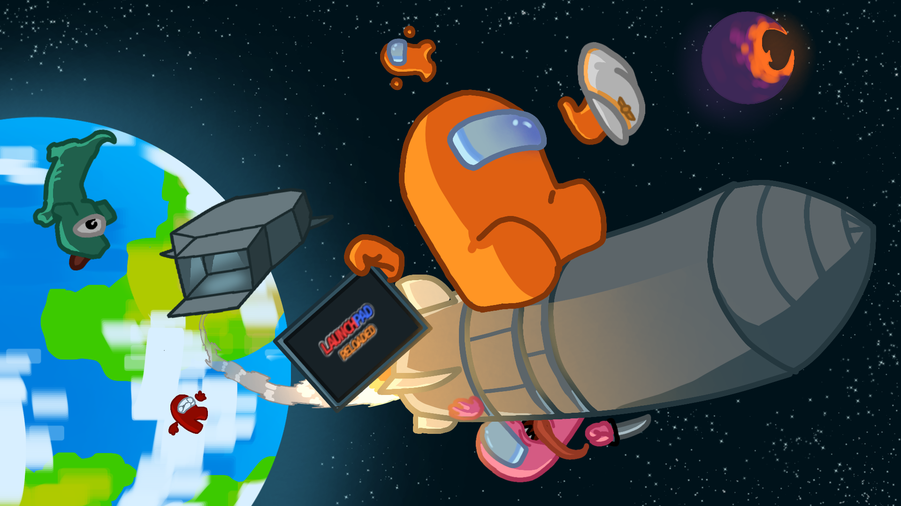

<h1 align="center">Launchpad: Reloaded</h1>
 
 

# Launchpad: Reloaded
Launchpad is a mod for Among Us that adds in brand new roles, features, and gamemodes! It is designed so that the roles and features stay somewhat consistent with the original game and don't feel out of place!

## Features
You can read about all of the features on the [wiki](https://launchpad.xtracube.dev/), but here are a couple of them:
- Gradient Colors
- Special voting modes
- Feature-rich roles
- New game options
- Exciting gamemodes

## Compatibility
- Launchpad supports 2024.10.29 and 2024.11.26 on PC and Android. (soon)
- Launchpad is **not** a host-only mod. Every player needs to install it to enjoy.
- Launchpad does **not** work on normal Among Us servers. We host our own private game servers instead.

## Installation
- The latest version can be easily downloaded using the Launcher application, available in the Discord server, or here.
- For a manual installation, you need to download the latest Unity.Il2Cpp win-x86 BepInEx build, Reactor, Mira and this mod
